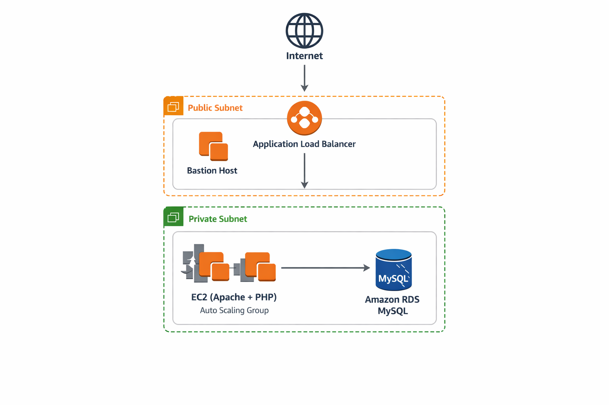

# AWS 3-Tier Web Architecture Project

This project demonstrates a scalable and secure **3-tier web architecture on AWS**.

## Architecture Overview

User → Application Load Balancer → Auto Scaling EC2 → Amazon RDS MySQL

## Components Used

- Bastion Host (Secure SSH Access)
- Application Load Balancer
- Auto Scaling Group
- EC2 Instances (Apache + PHP)
- Amazon RDS MySQL
- Public and Private Subnets
- Security Groups
- Internet Gateway
- NAT Gateway

## Features

- High availability using Auto Scaling
- Secure database in private subnet
- Load balancing across EC2 instances
- Bastion host for secure SSH access

## Architecture Diagram

## Author

Adekunle Adeoye
